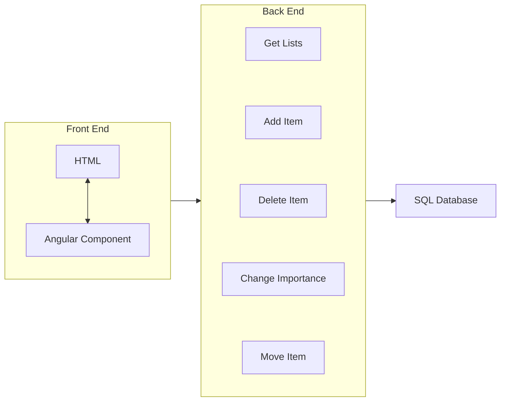

# Shopping List Manager
##### Made by Caleb Griffin

## Notes and Planning
### Required Features
- 2 lists: To buy list and previously bought list
- Add and remove items to the to buy list
- Mark items as important
    - Important items appear at the top of the list
    - Important items are highlighted in some way (bold text, different colour?)
- Move items from to buy list to bought list (marking them as not important)
- Sort items alphabetically by default, but the user can change the order (important items are always at the top)
- Add items to the to buy list from the previously bought list
    - If the item is already in the to buy list, the amount is increased by 1

### My Ideas
##### Project Setup
- Angular front end
- C# .NET Core back end
- SQL database
##### Initial Thoughts
- It will be easier to manage a single list of items, where each item tracks which list it is on and the sort order and type (alphabetical or custom)
- Each item should also store the name and amount and whether it is important
- The UI should contain 2 tables, one for each list of items
    - The table will show the amount, name, and importance of each item
- The UI will also contain a form or input boxes for adding new items

### Pseudo Code
```csharp
// Item class to be stored in the database
class Item {
    Guid id;
    string name;
    int amount;
    bool isImportant;
    int sortOrder;
    int listType; // 0 = to buy, 1 = bought
    int sortMode; // 0 = alphabetical, 1 = custom
}
```

### Flowchart


## Time Spent
- Setup and Planning: 1 hour
- Task 1:
- Task 2:
- Task 3:
- Task 4:
- Task 5: