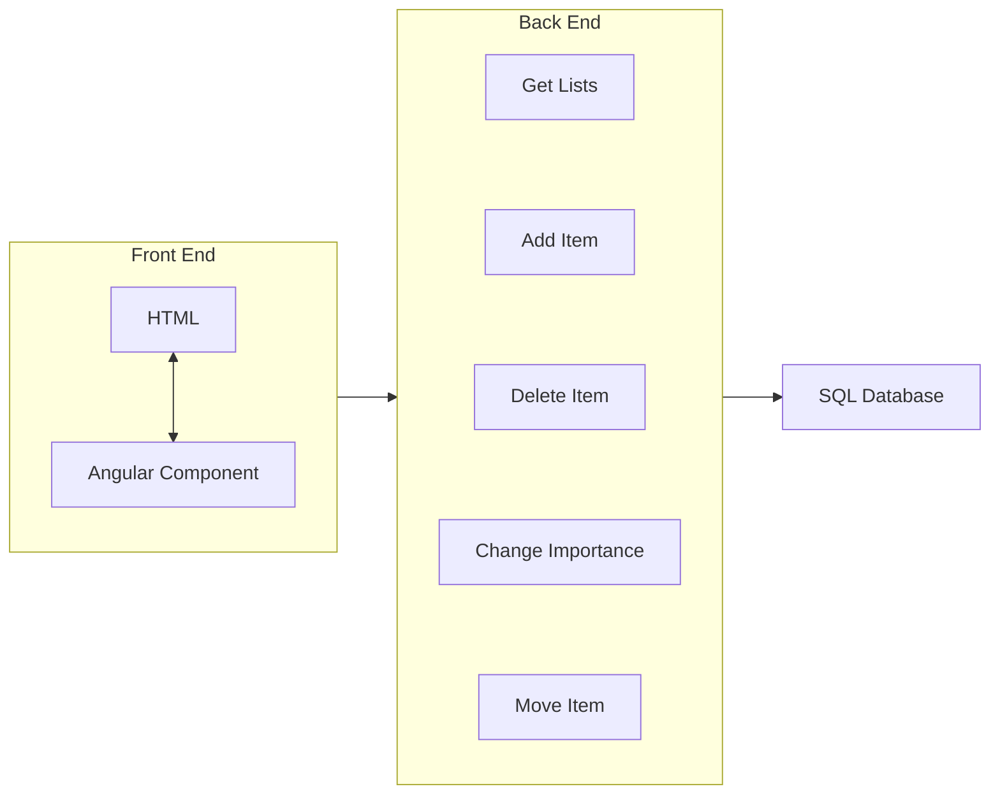

# Shopping List Manager
##### Made by Caleb Griffin

## Demo Video
[]

I've included a demo video because the SQL server that I'm using has security restrictions meaning that only ip addresses that I've whitelisted can access it. If you email me your **public** ip address then I can add it to the whitelist and you can access and test the project yourself.

The rest of this document contains the planning that I did at the start of the project and the time that I spent on each task.

## Notes and Planning
### Required Features
- 2 lists: To buy list and previously bought list
- Add and remove items to the to buy list
- Mark items as important
    - Important items appear at the top of the list
    - Important items are highlighted in some way (bold text, different colour?)
- Move items from to buy list to bought list (marking them as not important)
- Sort items alphabetically by default, but the user can change the order (important items are always at the top)
- Add items to the to buy list from the previously bought list
    - If the item is already in the to buy list, the amount is increased by 1

### My Ideas
##### Project Setup
- Angular front end
- C# .NET Core back end
- SQL database
##### Initial Thoughts
- It will be easier to manage a single list of items, where each item tracks which list it is on and the sort order and type (alphabetical or custom)
- Each item should also store the name and amount and whether it is important
- The UI should contain 2 tables, one for each list of items
    - The table will show the amount, name, and importance of each item
- The UI will also contain a form or input boxes for adding new items

### Pseudo Code
```csharp
// Item class to be stored in the database
class Item {
    Guid id;
    string name;
    int amount;
    bool isImportant;
    int sortOrder;
    int listType; // 0 = to buy, 1 = bought
    int sortMode; // 0 = alphabetical, 1 = custom
}
```

### Flowchart


## Time Spent
- **Setup and Planning: 1 hour**
    - Created the Angular and C# project using Visual Studio
    - Planned the project structure and features (this document)
- **Task 1: 2 hours**
    - Created foundation for the front end, back end, and database
    - Connected front end -> back end -> database
    - Added the ability to display the ToBuy list
    - Added the ability to add and remove items from the ToBuy list
- **Task 2: 20 minutes**
    - Added the ability to mark items as important
    - The important items are now displayed at the top of the list
- **Task 3: 20 minutes**
    - Added the previously bought list to the UI
    - Added the ability to move items to the previously bought list
    - Added the ability to delete items from the previously bought list
- **Task 4: 1 hour**
    - Added the sorting modes to the ToBuy list
    - Added the ability to sort either alphabetically or with the custom sort order
    - Added the ability to move the items up and down in the ToBuy list
- **Task 5: 10 minutes**
    - Added the ability to add an item from the previously bought list to the ToBuy list
    - If the item already exists in the ToBuy list then the amount is increased by 1 instead
- **Extras: 20 minutes**
    - Added a favicon to the website
    - Recorded a video of the project
    - Uploaded the project to GitHub